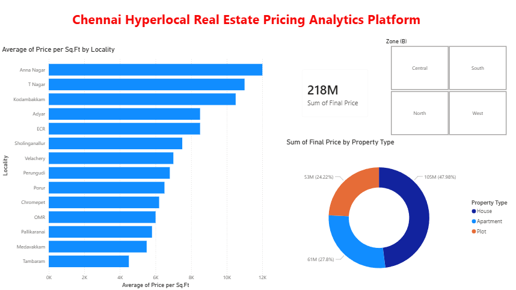
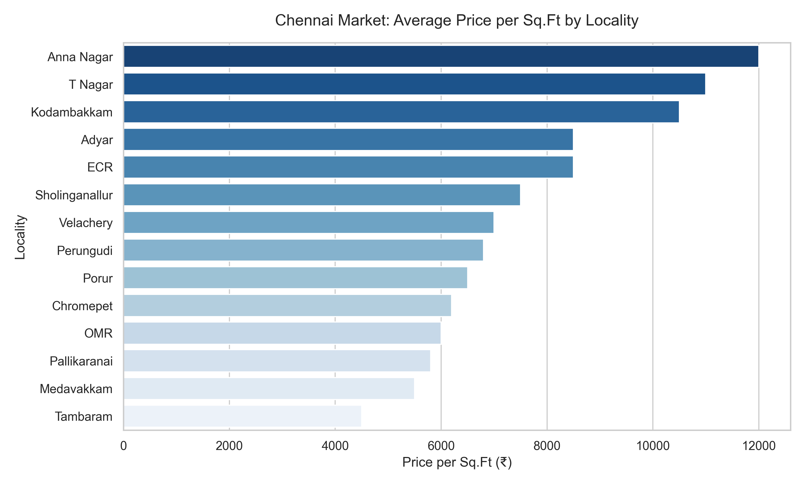
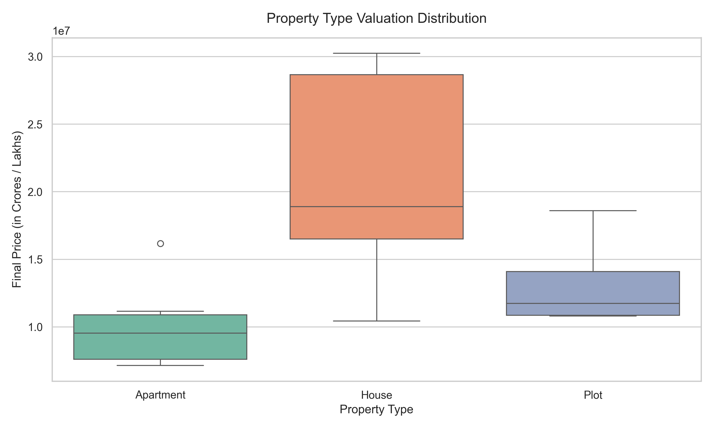

# Chennai Hyperlocal Real Estate Pricing Analytics Platform

An end-to-end interactive data analytics workbook and predictive engine built to evaluate, clean, and visualize micro-market residential property valuations across Chennai. This platform seamlessly bridges programmatically generated exploratory analysis using **Python (Pandas, Seaborn, Matplotlib)** with a presentation-ready **Microsoft Power BI Desktop Dashboard** for stakeholder metrics monitoring.

---

## Analytics Dashboard & Production Visualizations

### 1. Power BI Interactive Executive Dashboard
The production dashboard tracks overall real estate transactions, calculating market caps (`Sum of Final Price`), isolating regional quadrants (`Zone` matrix), and detailing categorical performance matrices across Apartments, Houses, and Plots.



### 2. Market Pricing Dynamics & Structural Distributions (Python Module)
Generated programmatically via the integrated `analytics_engine.py` pipeline, these visualization exports deliver precise cross-sectional pricing benchmarks.

| Chennai Market: Average Price per Sq.Ft by Locality | Property Type Valuation Distribution |
| :---: | :---: |
|  |  |
---

## Key Features & Architectural Mechanics

* **Hyperlocal Rate Profiling**: Auto-ranks average per-square-foot baseline valuations across premium core territories (Anna Nagar, T Nagar, Adyar) relative to high-growth outer corridors (Tambaram, OMR, Sholinganallur).
* **Asset Valuation Spread Analytics**: Utilizes specialized statistical box-and-whisker modeling to delineate structural spread anomalies, outliers, and median cost variances between standalone residential houses, apartments, and plot developments.
* **Algorithmic Predictive Engine**: Features a built-in CLI-driven prediction workflow that matches user inputs against historical baselines, applying specialized logical conditional overlays (such as a 5% infrastructure development surcharge on all assigned Tier-1 locations).
* **Automated Image Rendering**: Script configuration handles raw dataframe ingest pipelines and dynamically overwrites high-resolution visualization frames directly inside local workspace directories.

---

## Core Repository Structure & Component Deliverables

The local root architecture consists of the following technical assets:
* **`Real Estate Pricing Analytics.xlsx`**: The multi-sheet analytical source engine consisting of structured property observations, indexing baseline metadata including `Locality`, `Property Size (Sq.Ft)`, `Price per Sq.Ft`, `Total Price`, `Zone`, `Tier`, `Premium Charge`, and `Final Price`.
* **`analytics_engine.py`**: Automated structural Python pipeline configuration conducting standard aggregations, Seaborn multi-plot renderings, and user valuation calculations.
* **`Chennai-Hyperlocal-Real-Estate-Analytics-Project.pbix`**: Production-ready Microsoft Power BI master desktop document embedding underlying data schemas, custom DAX metrics, and dashboard frames.
* **`Chennai-Hyperlocal-Real-Estate-Analytics-preview.png`**: High-fidelity export representing the primary visual user interface layer of the Power BI application dashboard.
* **`locality_price_trends.PNG`**: Programmatic horizontal bar chart plotting localized performance sorting average square footage rates descending.
* **`property_valuation_distribution.png`**: Statistical box plot evaluating real estate distribution spreads and pricing thresholds categorized by property classification labels.

---

## Installation & Execution Guidelines

### 1. Environment Package Requirements
Ensure that your development environment includes Python (3.8 or higher recommended) alongside standard analytical dependency libraries:

Bash
```pip install pandas matplotlib seaborn openpyxl ```


### 2.Initiating the Ingestion Pipeline & Predictive CLI Tool
Execute the Python script to refresh structural visualization layers and load the terminal interactive pricing console:

Bash
```python analytics_engine.py```

### 3.Pipeline Ingest Example Workflow Execution

=============================================
WELCOME TO CHENNAI REAL ESTATE PRICE PREDICTOR ENGINE
=============================================
Available Localities:
Anna Nagar, T Nagar, Kodambakkam, Adyar, ECR, Sholinganallur, Velachery, Perungudi, Porur, Chromepet, OMR, Pallikaranai, Medavakkam, Tambaram

Enter the Locality from the list above: Anna Nagar
Property Types: Apartment, House, Plot
Enter Property Type: House

Enter the Property Size (in Sq.Ft): 2400

----------------------------------------
 VALUATION ESTIMATION REPORT
----------------------------------------

 Location      : Anna Nagar (Central Zone - Tier 1)
 
 Property Type : House
 
 Size           : 2,400 Sq.Ft
 
 Rate per Sq.Ft: ₹12,000 / Sq.Ft
 
 Base Valuation : ₹28,800,000.00
 
 Premium Charge : ₹1,440,000.00 (5% Tier-1 Dev Fee)
 
----------------------------------------
FINAL ESTIMATED PRICE: ₹30,240,000.00
==================================================
